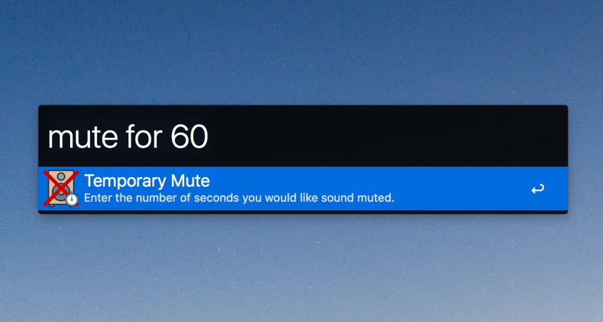
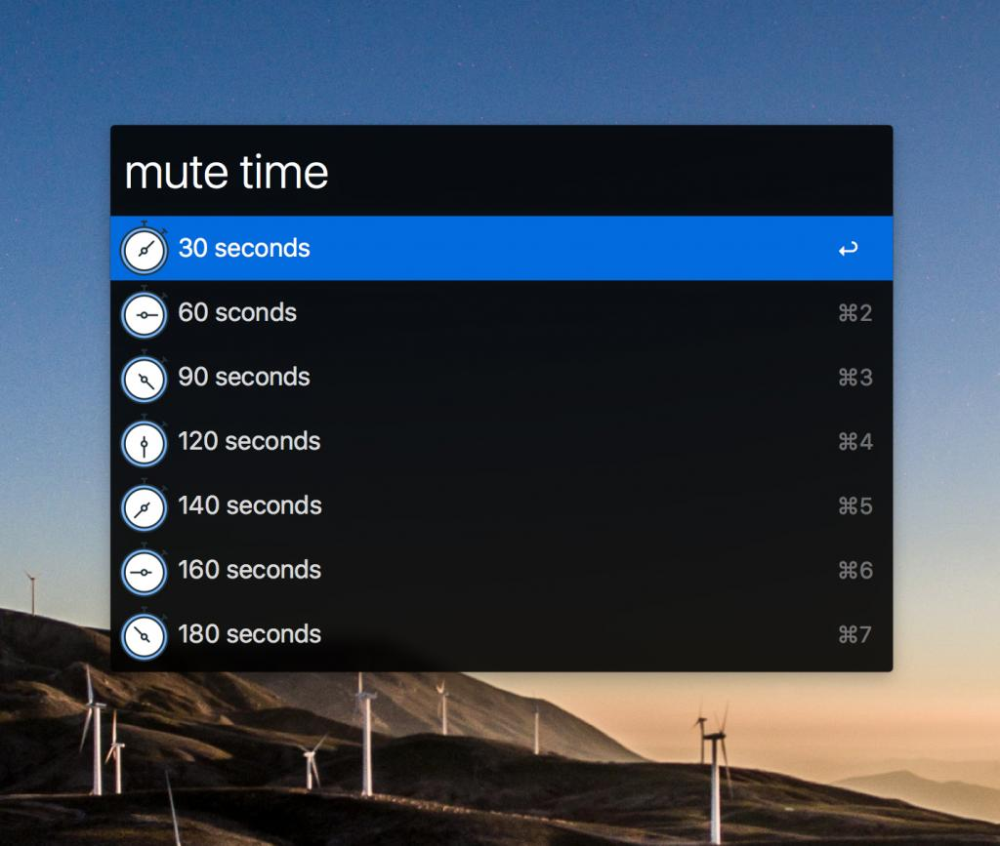

# Temporary Mute for Alfred

### Description:

The Temporary Mute workflow allows a user to mute the volume of their computer for a specified duration of time. Once the duration of time has elapsed, the computer's volume is automatically unmuted. The user can also manually unmute the volume at any time before the defined duration is over.
___

### Usage:

The workflow has two modes which can be used:

`mute for`: Using the "mute for" keyword phrase allows the computer to be muted for the exact number of seconds specified. Simply include a number after "mute for" and the volume will remain muted for that number of seconds. [Example: "mute for 90"]

 
`Mute time`: Using the "mute time" keyword phase allows the user to select from predefined periods of time when muting the computer. After typing "mute time", select one of the predefined durations and the computer will be muted for that amount of time.

___

### Potential use cases:

- Muting commercials that play during sports broadcasts. Works great for football, basketball, and baseball streams.
- Mute streaming music or radio when a coworker asks you a question or approaches to talk for a moment.
- Muting preroll commercials on YouTube or other streaming video.
___
